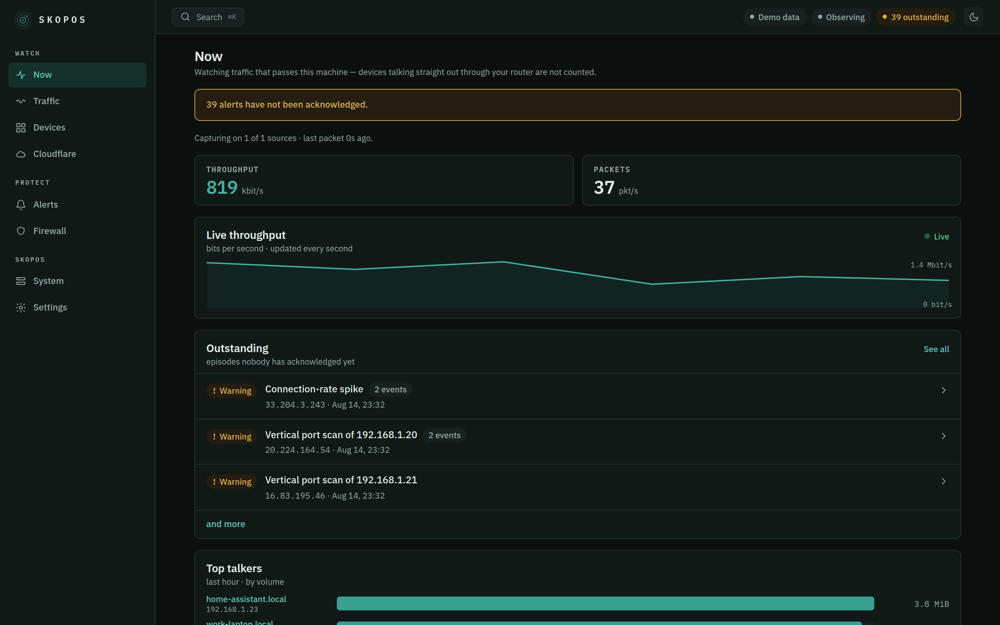
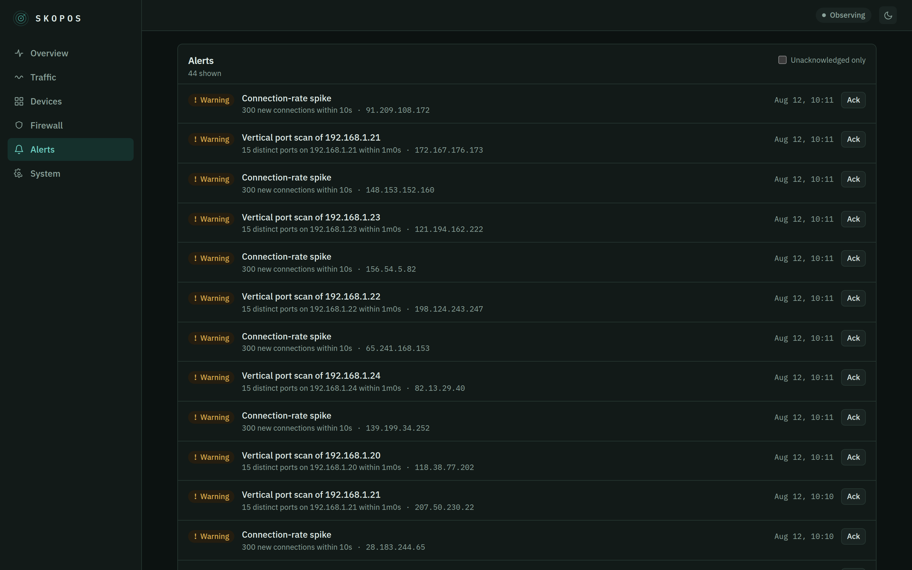
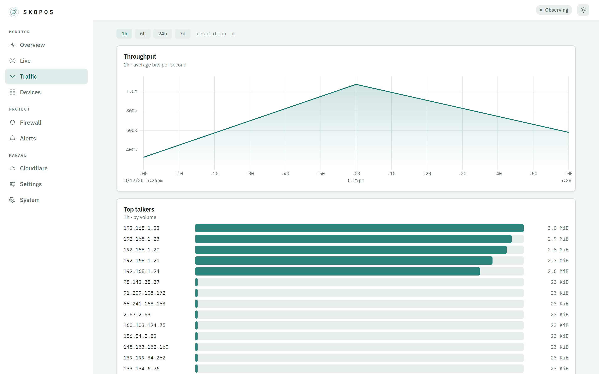

<div align="center">

# Skopos

**σκοπός — the watcher.**
Traffic monitoring, firewall management and ntfy alerting for your NAS,
in a single container configured by a single YAML file.

[](https://github.com/julianhintermann-cmd/skopos/actions/workflows/ci.yml)
[](https://github.com/julianhintermann-cmd/skopos/actions/workflows/release.yml)
[](LICENSE)
[](https://github.com/julianhintermann-cmd/skopos/pkgs/container/skopos)



</div>

## What it does

- **Traffic monitoring** — live packet capture on the host's interfaces
  (AF_PACKET), aggregated into flows, with a LAN device inventory and readable
  names from DNS/SNI. Time-series that stay fast for months via rolled-up
  aggregates.
- **Firewall management** — block and unblock IPs and CIDRs through a dedicated
  nftables table with in-kernel TTL expiry. State is declarative and restored on
  every start, so reboots and updates never drop your protection. Ships in
  **`observe` mode** — nothing is blocked until you deliberately arm it.
- **Detection** — port scans (vertical & horizontal), connection-rate spikes,
  blocklist-feed hits (FireHOL L1, Spamhaus DROP, or any URL) and new-device
  alerts. Thresholds are yours in YAML; a per-source cooldown means one scan is
  one notification, not five hundred.
- **ntfy alerts** — push to your self-hosted ntfy or ntfy.sh, with severity
  mapped to priority, tap-through to the alert, and a generic webhook too.
- **Web dashboard** — live throughput, traffic explorer, devices, firewall,
  alert history and system health. Light and dark, English UI.
- **One YAML file** — every path, interface, threshold, topic and credential
  comes from `config.yaml`. Nothing about your environment is hardcoded.

<div align="center">


</div>

## Try it in 30 seconds

No NAS, no privileges, no real traffic — the demo mode fabricates a plausible
network (including the occasional port scan) so you can click around:

```sh
docker run --rm -p 8686:8686 -e SKOPOS_DEMO=1 ghcr.io/julianhintermann-cmd/skopos
```

Open <http://localhost:8686>.

## Deploy on a NAS

Skopos runs as one container. The reference
[`deploy/docker-compose.yml`](deploy/docker-compose.yml) is built for exactly
this: **hot data on your SSD, cold archive on your HDD or NAS share.**

```yaml
services:
  skopos:
    image: ghcr.io/julianhintermann-cmd/skopos:latest
    container_name: skopos
    restart: unless-stopped
    network_mode: host                 # capture + host firewall need this
    cap_drop: [ALL]
    cap_add: [NET_ADMIN, NET_RAW]      # exactly two capabilities — see SECURITY.md
    security_opt: [no-new-privileges:true]
    read_only: true
    tmpfs: [/tmp]
    volumes:
      - /volume1/docker/skopos/config:/config   # SSD — config.yaml
      - /volume1/docker/skopos/data:/data       # SSD (hot) — database, state, spool
      - /mnt/nas/skopos/archive:/archive        # HDD/NAS (cold) — archives, logs, backups
    mem_limit: 512m
    cpus: 2.0
```

Adjust the two volume source paths to your box, then:

```sh
docker compose up -d
```

Open `http://<nas-ip>:8686`. Out of the box Skopos monitors and alerts but
**enforces nothing** — watch the dashboard for a while, then set
`firewall.enforcement: enforce` when you're ready.

### Storage: hot vs. cold

Skopos keeps two independent volumes, both fully configurable:

| Volume | Mount | Put it on | Holds |
| ------ | ----- | --------- | ----- |
| **Hot** | `/data` | SSD (fast, small) | SQLite database, runtime state, spool buffer. Capped (`storage.hot_max_size`, default 5 GiB) — oldest raw flows are dropped first, aggregates kept. |
| **Cold** | `/archive` | HDD / NAS share (large, cheap) | Parquet flow archives, rotated logs, alert archive, daily database backups. If it goes offline, Skopos spools to hot storage and writes through later — capture never stops. |

## Configuration

One file, `config.yaml`. **An empty file is valid** — every option has a
working default. A minimal real-world config:

```yaml
interfaces: [auto]                     # or [eth0, eth1]

server:
  # generate the hash with: docker run --rm -it ghcr.io/julianhintermann-cmd/skopos hash-password
  auth:
    username: admin
    password_hash: "$argon2id$v=19$m=65536,t=3,p=2$…"
  external_url: https://skopos.example.com   # click target of push notifications

notify:
  ntfy:
    url: https://ntfy.example.com
    topic: skopos
    token: ${SKOPOS_NTFY_TOKEN}         # from the environment, not the file

firewall:
  enforcement: observe                  # observe → enforce when you're ready
```

- **Secrets** use `${VAR}` / `${VAR:-default}` interpolation, so tokens and
  hashes can come from the environment or Docker secrets.
- **Validate** any config without starting: `skopos validate`.
- **Editor autocomplete:** point yaml-language-server at the published schema:
  `# yaml-language-server: $schema=./deploy/config.schema.json`

The **[full configuration reference](docs/configuration.md)** documents every
option, its type and its default — generated from the source, so it never
drifts. A fully-commented example lives in
[`deploy/config.example.yaml`](deploy/config.example.yaml).

## How it works

```
interfaces → capture (AF_PACKET) → flow aggregator → detectors → policy ┬→ ntfy / webhook
                                          │                              └→ nftables (inet skopos)
                                          └→ SQLite (hot) → Parquet archive (cold)
                                                     ↑
                                            REST + SSE API → React dashboard (embedded)
```

A single Go binary runs the whole pipeline; the React dashboard is embedded
into it, so the image is one self-contained file. Packet **headers** and
DNS/SNI **names** are processed — raw packets are never written to disk.

- **Backend:** Go (native AF_PACKET capture and nftables via netlink; a small,
  static, multi-arch image).
- **Storage:** SQLite (WAL) with rollup tables on hot storage; Parquet archives
  on cold.
- **Frontend:** React + TypeScript + Vite, uPlot for time series.
- **Images:** `linux/amd64` and `linux/arm64`, on GHCR and Docker Hub.

## Security

Skopos captures traffic and manages a firewall, so it asks for real privileges —
and constrains them tightly: host networking plus exactly two capabilities
(`NET_RAW` for capture, `NET_ADMIN` for nftables), everything else dropped, a
read-only root filesystem, and `no-new-privileges`. The gateway and your
allowlist can never be blocked. See **[SECURITY.md](SECURITY.md)** for the full
threat model and the derivation of every privilege.

## CLI

The image's entrypoint is the `skopos` binary:

| Command | Purpose |
| ------- | ------- |
| `serve` | Run the monitor, firewall and dashboard (default). |
| `validate` | Load and validate the configuration, then exit. |
| `hash-password` | Generate an Argon2id hash for `config.yaml`. |
| `notify-test` | Send a test notification to the configured channels. |
| `health` | Probe the local health endpoint (used by the container HEALTHCHECK). |
| `version` | Print version information. |

## Build from source

Requirements: Go ≥ 1.24, Node ≥ 22.

```sh
make build        # builds the web UI and a binary with the dashboard embedded
make run-demo     # runs the demo on :8686 with no privileges
make test         # Go tests + web type-check
make lint         # golangci-lint + tsc
```

See [CONTRIBUTING.md](CONTRIBUTING.md) for the development workflow and commit
conventions.

## License

[AGPL-3.0](LICENSE) — free to run, study, share and improve; network services
built on modified versions must publish their source. Chosen so Skopos and its
improvements stay open for everyone who self-hosts it.
