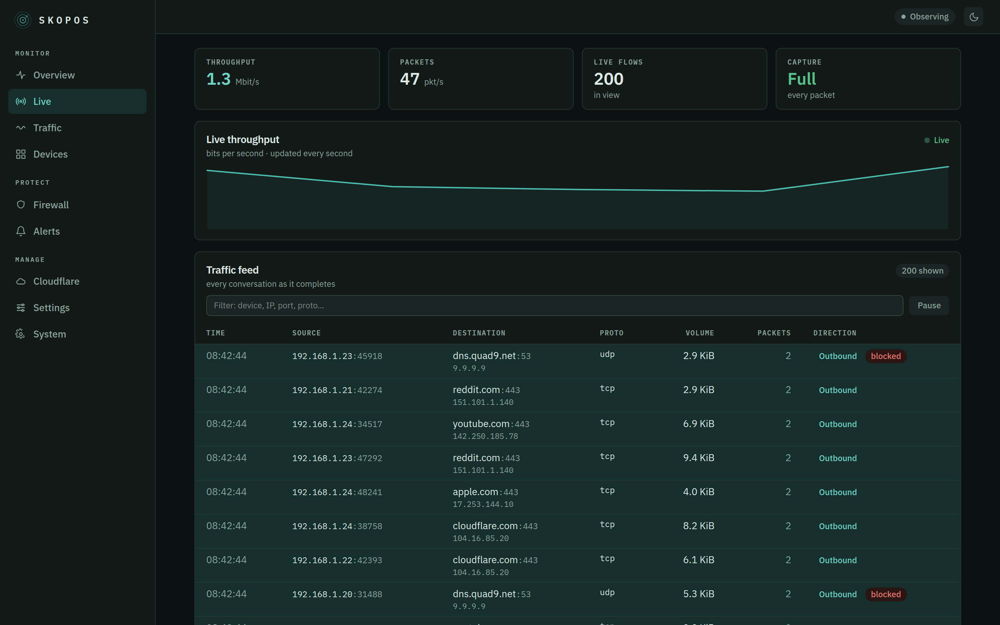
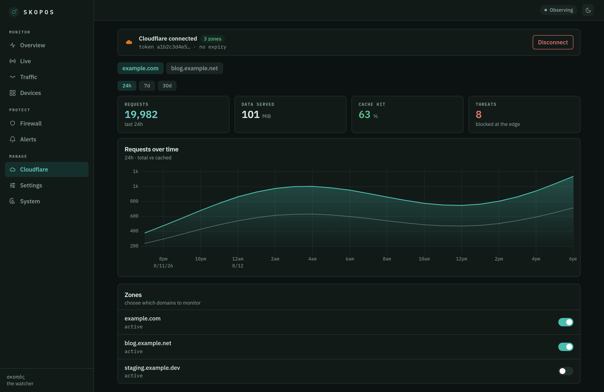

<div align="center">


# Skopos

**σκοπός — the watcher.**
Traffic monitoring, firewall management and ntfy alerting for your NAS,
in a single container configured by a single YAML file.

[](https://github.com/julianhintermann-cmd/skopos/actions/workflows/ci.yml)
[](https://github.com/julianhintermann-cmd/skopos/actions/workflows/release.yml)
[](LICENSE)
[](https://github.com/julianhintermann-cmd/skopos/pkgs/container/skopos)


</div>

## What it does

- **Traffic monitoring** — live packet capture on the host's interfaces
  (AF_PACKET), aggregated into flows, with a LAN device inventory and readable
  names from DNS/SNI, split by upload and download. Months of history via
  rolled-up aggregates. Every bucket records what the capture was doing while
  it was filled, so a chart breaks where nothing was measured instead of
  drawing a line across it, and a sampled reading is labelled as the floor it
  is.
- **Live traffic** — every conversation as it completes, with throughput
  updating once a second over a push stream (no busy-polling), device names
  resolved inline. "Live" is the leftmost position on the Traffic page's time
  control, so the same filters apply whether you are watching the last minute
  or the last month.
- **Name your devices** — give any host on the network a friendly name straight
  from the dashboard; it sticks across sightings and takes precedence over the
  discovered hostname everywhere.
- **Cloudflare** — connect a read-only API token in the UI (not the YAML) and
  monitor request traffic, cache hit rate and edge-blocked threats for your own
  domains, next to your LAN. The token is sealed with AES-GCM and never leaves
  the NAS.
- **Firewall management** — block and unblock IPs and CIDRs through a dedicated
  nftables table with in-kernel TTL expiry. State is declarative and restored on
  every start, so reboots and updates never drop your protection. Skopos reads
  the kernel back every two minutes and reports one verdict —
  `observing`, `enforcing`, `partial`, `degraded`, `unverified` or `unable` —
  so a screen can say "unconfirmed since 09:14" rather than painting rows green
  on the strength of a configuration file. Ships in **`observe` mode** —
  nothing is blocked until you deliberately arm it.
- **Detection** — port scans (vertical & horizontal), connection-rate spikes,
  blocklist-feed hits (FireHOL L1, Spamhaus DROP, or any URL) and new-device
  alerts. Thresholds are yours in YAML; a per-source cooldown means one scan is
  one notification, not five hundred.
- **ntfy alerts** — push to your self-hosted ntfy or ntfy.sh, with severity
  mapped to priority, tap-through to the alert, and a generic webhook too.
- **Web dashboard** — eight pages in three groups: *Watch* (Now, Traffic,
  Devices, Cloudflare), *Protect* (Alerts, Firewall) and *Skopos* (System,
  Settings). Every alert and incident has its own page, so a push notification
  opens on the thing it was about. Filters and time ranges live in the URL, so
  a view reloads, shares and goes back. Light, dark or your operating system's
  choice; English UI.
- **One YAML file** — every path, interface, threshold, topic and credential
  comes from `config.yaml`. Nothing about your environment is hardcoded. The one
  deliberate exception is the Cloudflare token, which you connect in the UI and
  Skopos stores encrypted — secrets like that never belong in a config file.

<div align="center">




</div>

## Try it in 30 seconds

No NAS, no privileges, no real traffic — the demo mode fabricates a plausible
network (including the occasional port scan) so you can click around:

```sh
docker run --rm -p 8686:8686 -e SKOPOS_DEMO=1 ghcr.io/julianhintermann-cmd/skopos
```

Open <http://localhost:8686>.

## Deploy on a NAS

Skopos runs as one container. The reference
[`deploy/docker-compose.yml`](deploy/docker-compose.yml) is built for exactly
this: **hot data on your SSD, cold archive on your HDD or NAS share.**

```yaml
services:
  skopos:
    image: ghcr.io/julianhintermann-cmd/skopos:latest
    container_name: skopos
    restart: unless-stopped
    network_mode: host                 # capture + host firewall need this
    cap_drop: [ALL]
    cap_add: [NET_ADMIN, NET_RAW]      # exactly two capabilities — see SECURITY.md
    security_opt: [no-new-privileges:true]
    read_only: true
    tmpfs: [/tmp]
    volumes:
      - /volume1/docker/skopos/config:/config   # SSD — config.yaml
      - /volume1/docker/skopos/data:/data       # SSD (hot) — database, runtime state
      - /mnt/nas/skopos/archive:/archive        # HDD/NAS (cold) — backups and logs
    mem_limit: 512m
    cpus: 2.0
```

Adjust the two volume source paths to your box, then:

```sh
docker compose up -d
```

Open `http://<nas-ip>:8686`. Out of the box Skopos monitors and alerts but
**enforces nothing** — watch the dashboard for a while, then set
`firewall.enforcement: enforce` when you're ready.

### Storage: hot vs. cold

Skopos keeps two independent volumes, both fully configurable:

| Volume | Mount | Put it on | Holds |
| ------ | ----- | --------- | ----- |
| **Hot** | `/data` | SSD (small) | SQLite database and runtime state. Capped (`storage.hot_max_size`, default 5 GiB) — oldest raw flows are dropped first, aggregates kept. |
| **Cold** | `/archive` | HDD / NAS share (large, cheap) | Daily database backups, and JSON logs under `logs/` while `logging.file` is on. If it goes offline the backup is skipped and Skopos says so; capture never stops. |

Retention is per table and set in `storage.retention`: raw flows, the three
rollups and their capture-coverage records, and — new in 0.4.0 — alerts and
the incidents grouping them (`storage.retention.alerts`, default 365d, `0` to
keep forever). Rows past their retention are deleted, not exported:
`storage.archive_at` is accepted and inert, and the daily backup is the
durable copy.

## Configuration

One file, `config.yaml`. **An empty file is valid** — every option has a
working default. A minimal real-world config:

```yaml
interfaces: [auto]                     # or [eth0, eth1]

server:
  # generate the hash with: docker run --rm -it ghcr.io/julianhintermann-cmd/skopos hash-password
  auth:
    username: admin
    password_hash: "$argon2id$v=19$m=65536,t=3,p=2$…"
  external_url: https://skopos.example.com   # click target of push notifications

notify:
  ntfy:
    url: https://ntfy.example.com
    topic: skopos
    token: ${SKOPOS_NTFY_TOKEN}         # from the environment, not the file

firewall:
  enforcement: observe                  # observe → enforce when you're ready
```

- **Secrets** use `${VAR}` / `${VAR:-default}` interpolation, so tokens and
  hashes can come from the environment or Docker secrets.
- **Validate** any config without starting: `skopos validate`.
- **Editor autocomplete:** point yaml-language-server at the published schema:
  `# yaml-language-server: $schema=./deploy/config.schema.json`

The **[full configuration reference](docs/configuration.md)** documents every
option, its type and its default — generated from the source, so it never
drifts. A fully-commented example lives in
[`deploy/config.example.yaml`](deploy/config.example.yaml).

### Connect Cloudflare (in the UI, not the YAML)

To watch traffic for your own domains, open **Cloudflare** in the dashboard and
paste a scoped API token — there is nothing to add to `config.yaml`. Create the
token from your [Cloudflare API tokens](https://dash.cloudflare.com/profile/api-tokens)
page as a **Custom token** with two read-only permissions, **Zone · Analytics ·
Read** and **Zone · Zone · Read**. Skopos verifies it, seals it with AES-GCM
(the key lives in the database's `meta` table, like the session key), and never
returns it or writes it to disk in the clear. Toggle which zones to monitor, and
revoke the token from Cloudflare at any time.

### AI explanations (optional, off by default)

Skopos can turn one alert into one paragraph of plain language. Open
**Settings → AI explanations**, pick **OpenAI**, **Anthropic** or
**OpenRouter** from the dropdown, and paste an API key. As with Cloudflare
there is nothing to add to `config.yaml`: the key is verified with the
provider before anything is written, sealed with AES-GCM, and never returned
by any endpoint.

**This is the one feature that sends data off your NAS**, which is why it is
off until you switch it on, and why storing a key does not switch it on.
Read this before you do:

- A request happens **only when you press "Explain"**. Nothing runs on a
  schedule, and with the integration off no request is made at all — not even
  a test one.
- **What is sent:** the detector name and severity, counts, the country, and
  addresses reduced to a shape like `192.168.1.x`.
- **What is never sent:** MAC addresses, device names you typed, DHCP
  hostnames, your public IP, packet contents, or your configuration. Every
  answer shows you the exact payload that left, so you can check rather than
  trust.
- A home network carries the browsing of everyone in the household, and they
  have not agreed to this. The provider's terms apply, not Skopos', and
  nothing can be recalled once it is sent.
- Answers come from a language model and **can be confidently wrong**. They
  sit beside the measurements, never in place of them.

## How it works

```
interfaces → capture (AF_PACKET) → flow aggregator ┬→ detectors → policy ┬→ ntfy / webhook
                                          │         │                     └→ nftables (inet skopos)
                                          │         └→ live stream ────────→ SSE → Live view
                                          └→ SQLite (hot) → daily backup (cold)
                                                     ↑
                                            REST + SSE API → React dashboard (embedded)
                                                     ↑
                    Cloudflare GraphQL analytics (token sealed at rest) ────┘
```

A single Go binary runs the whole pipeline; the React dashboard is embedded
into it, so the image is one self-contained file. Packet **headers** and
DNS/SNI **names** are processed — raw packets are never written to disk. The
flow sink is teed so every completed flow both persists and streams to the live
view; throughput is pushed once a second so open dashboards never busy-poll.

Reading DNS queries and TLS server names out of a household's traffic is the
most revealing thing Skopos does, so `capture.dns` and `capture.sni` gate it at
the parser: with either off, those names are never lifted out of the packet in
the first place, and there is no filtered copy anywhere to leak later. Turning
off `dns` also gives up mDNS device hostnames — a printer announcing itself is
filed by address and MAC instead. Turning off `sni` also ends the JA4 client
fingerprint, which comes out of the same handshake. **Before 0.4.0 both
switches were read by nothing and both parsers ran regardless**; if you set
either to `false` on an older version, it takes effect now.

- **Backend:** Go (native AF_PACKET capture and nftables via netlink; a small,
  static, multi-arch image).
- **Storage:** SQLite (WAL) with rollup tables on hot storage; daily backups
  on cold.
- **Frontend:** React + TypeScript + Vite, uPlot for time series.
- **Images:** `linux/amd64` and `linux/arm64`, on GHCR and Docker Hub.

### How blocking works

Four things about blocking that save you a support ticket:

- **Observe first.** The shipping default is `firewall.enforcement: observe`:
  every block is recorded, counted and shown, but **no packet is dropped**
  until you deliberately set `enforce`. The Firewall view carries a banner
  while you're in observe mode, and each block shows what it *would have*
  dropped so you can arm enforcement with evidence.
- **Blocked traffic stays visible — by design.** The capture tap sits on the
  wire, *before* netfilter. Packets from a blocked address still appear in the
  Live view (tagged `blocked`) and still tick the block's "Dropped" counter
  while the kernel discards them before any service sees them. Seeing arrivals
  from a blocked IP is the block *working*, not failing: what disappears is
  the response — connections never establish.
- **Scope.** Rules live in the kernel of the machine running Skopos
  (`inet skopos` table). They protect that machine — which is exactly where
  your port forwards point — plus anything it routes. Traffic between other
  LAN devices and the internet flows through your router, not through Skopos,
  and is out of its reach.
- **Want Skopos to see the whole LAN?** Point a switch mirror/SPAN port at
  one of the NAS's interfaces, name it under `interfaces`, and list it under
  `capture.mirror.interfaces`. Skopos then observes every device's traffic,
  not just its own — visibility becomes network-wide while blocking keeps the
  reach described here.
- **Per-device policies have the same reach.** "LAN only" and "Quarantine"
  are kernel rules on the device's address; they bite on traffic this machine
  sees or routes. If your NAS is not the gateway, a device's own path out
  through the router is not affected — the dashboard says so rather than
  implying a guarantee it cannot make.
- **Countries are blocked preventively.** Listed countries' networks (from the
  GeoIP database) are loaded into the kernel and dropped on the way in;
  established connections your own devices opened stay untouched, so blocking
  a country never cuts off updates or CDNs you actively use. The reactive
  backstop (block-on-sight while the database is still downloading) follows
  the same rule: it only reacts to inbound connection attempts, never to
  reply traffic of connections your side opened. Per-IP blocks, in contrast,
  are absolute in both directions.

## Security

Skopos captures traffic and manages a firewall, so it asks for real privileges —
and constrains them tightly: host networking plus exactly two capabilities
(`NET_RAW` for capture, `NET_ADMIN` for nftables), everything else dropped, a
read-only root filesystem, and `no-new-privileges`. The gateway and your
allowlist can never be blocked. See **[SECURITY.md](SECURITY.md)** for the full
threat model and the derivation of every privilege.

**Behind a reverse proxy**, list the proxy's networks under
`server.trusted_proxies` (CIDR form, empty by default). The login rate limiter
counts failed attempts per client address; `X-Forwarded-For` costs nothing to
forge, so it is honoured only for connections coming from a network you named,
and everything else is identified by the address it actually came from. A
malformed entry refuses to start rather than being silently dropped.

## CLI

The image's entrypoint is the `skopos` binary:

| Command | Purpose |
| ------- | ------- |
| `serve` | Run the monitor, firewall and dashboard (default). |
| `validate` | Load and validate the configuration, then exit. |
| `hash-password` | Generate an Argon2id hash for `config.yaml`. |
| `notify-test` | Send a test notification to the configured channels. |
| `health` | Probe the local health endpoint (used by the container HEALTHCHECK). |
| `version` | Print version information. |

## Build from source

Requirements: Go ≥ 1.24, Node ≥ 22.

```sh
make build        # builds the web UI and a binary with the dashboard embedded
make run-demo     # runs the demo on :8686 with no privileges
make test         # Go tests + web type-check
make lint         # golangci-lint + tsc
```

See [CONTRIBUTING.md](CONTRIBUTING.md) for the development workflow and commit
conventions.

## License

[AGPL-3.0](LICENSE) — free to run, study, share and improve; network services
built on modified versions must publish their source. Chosen so Skopos and its
improvements stay open for everyone who self-hosts it.
